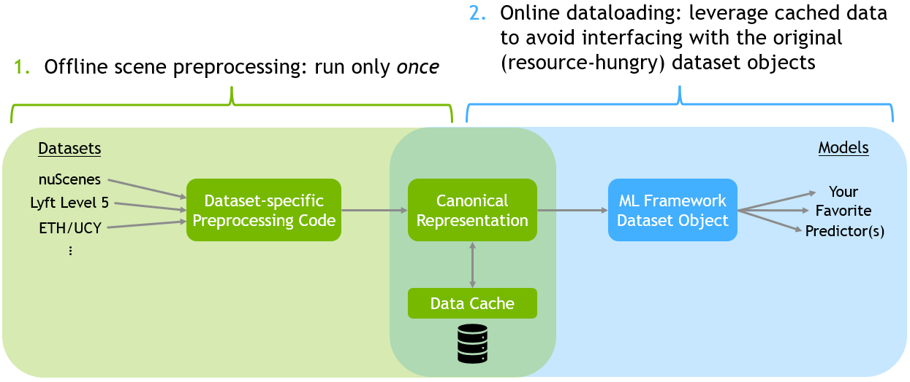

# trajdata: A Unified Interface to Multiple Human Trajectory Datasets

[](https://github.com/psf/black)
[](https://pycqa.github.io/isort/)
[](https://opensource.org/licenses/Apache-2.0)
[](https://zenodo.org/badge/latestdoi/488789438)
[](https://badge.fury.io/py/trajdata)

### Announcements

**Sept 2023**: [Our paper about trajdata](https://arxiv.org/abs/2307.13924) has been accepted to the NeurIPS 2023 Datasets and Benchmarks Track!

## Installation

The easiest way to install trajdata is through PyPI with
```sh
pip install trajdata
```

In case you would also like to use datasets such as nuScenes, Lyft Level 5, or Waymo Open Motion Dataset (which require their own devkits to access raw data or additional package dependencies), the following will also install the respective devkits and/or package dependencies.
```sh
# For nuScenes
pip install "trajdata[nusc]"

# For Lyft
pip install "trajdata[lyft]"

# For Waymo
pip install "trajdata[waymo]"

# For INTERACTION
pip install "trajdata[interaction]"

# All
pip install "trajdata[nusc,lyft,waymo,interaction]"
```
Then, download the raw datasets (nuScenes, Lyft Level 5, ETH/UCY, etc.) in case you do not already have them. For more information about how to structure dataset folders/files, please see [`DATASETS.md`](./DATASETS.md).

### Package Developer Installation

First, in whichever environment you would like to use (conda, venv, ...), make sure to install all required dependencies with
```
pip install -r requirements.txt
```
Then, install trajdata itself in editable mode with
```
pip install -e .
```

## Data Preprocessing [Optional]
The dataloader operates via a two-stage process, visualized below.

While optional, we recommend first preprocessing data into a canonical format. Take a look at the `examples/preprocess_data.py` script for an example script that does this. Data preprocessing will execute the first part of the diagram above and create data caches for each specified dataset.

**Note**: Explicitly preprocessing datasets like this is not necessary; the dataloader will always internally check if there exists a cache for any requested data and will create one if not.

## Data Loading

At a minimum, batches of data for training/evaluation/etc can be loaded the following way:
```py
import os
from torch.utils.data import DataLoader
from trajdata import AgentBatch, UnifiedDataset

# See below for a list of already-supported datasets and splits.
dataset = UnifiedDataset(
    desired_data=["nusc_mini"],
    data_dirs={  # Remember to change this to match your filesystem!
        "nusc_mini": "~/datasets/nuScenes"
    },
)

dataloader = DataLoader(
    dataset,
    batch_size=64,
    shuffle=True,
    collate_fn=dataset.get_collate_fn(),
    num_workers=os.cpu_count(), # This can be set to 0 for single-threaded loading, if desired.
)

batch: AgentBatch
for batch in dataloader:
    # Train/evaluate/etc.
    pass
```

For a more comprehensive example, please see `examples/batch_example.py`.

For more information on all of the possible `UnifiedDataset` constructor arguments, please see `src/trajdata/dataset.py`.

## Supported Datasets
Currently, the dataloader supports interfacing with the following datasets:

| Dataset | ID | Splits | Locations | Description | dt | Maps |
|---------|----|--------|------------|-------------|----|------|
| nuScenes Train/TrainVal/Val | `nusc_trainval` | `train`, `train_val`, `val` | `boston`, `singapore` | nuScenes prediction challenge training/validation/test splits (500/200/150 scenes) | 0.5s (2Hz) | :white_check_mark: |
| nuScenes Test | `nusc_test` | `test` | `boston`, `singapore` | nuScenes test split, no annotations (150 scenes) | 0.5s (2Hz) | :white_check_mark: |
| nuScenes Mini | `nusc_mini` | `mini_train`, `mini_val` | `boston`, `singapore` | nuScenes mini training/validation splits (8/2 scenes) | 0.5s (2Hz) | :white_check_mark: |
| nuPlan Train | `nuplan_train` | N/A | `boston`, `singapore`, `pittsburgh`, `las_vegas` | nuPlan training split (947.42 GB) | 0.05s (20Hz) | :white_check_mark: |
| nuPlan Validation | `nuplan_val` | N/A | `boston`, `singapore`, `pittsburgh`, `las_vegas` | nuPlan validation split (90.30 GB) | 0.05s (20Hz) | :white_check_mark: |
| nuPlan Test | `nuplan_test` | N/A | `boston`, `singapore`, `pittsburgh`, `las_vegas` | nuPlan testing split (89.33 GB) | 0.05s (20Hz) | :white_check_mark: |
| nuPlan Mini | `nuplan_mini` | `mini_train`, `mini_val`, `mini_test` | `boston`, `singapore`, `pittsburgh`, `las_vegas` | nuPlan mini training/validation/test splits (942/197/224 scenes, 7.96 GB) | 0.05s (20Hz) | :white_check_mark: |
| Waymo Open Motion Training | `waymo_train` | `train` | N/A | Waymo Open Motion Dataset `training` split | 0.1s (10Hz) | :white_check_mark: |
| Waymo Open Motion Validation | `waymo_val` | `val` | N/A | Waymo Open Motion Dataset `validation` split | 0.1s (10Hz) | :white_check_mark: |
| Waymo Open Motion Testing | `waymo_test` | `test` | N/A | Waymo Open Motion Dataset `testing` split | 0.1s (10Hz) | :white_check_mark: |
| Lyft Level 5 Train | `lyft_train` | `train` | `palo_alto` | Lyft Level 5 training data - part 1/2 (8.4 GB) | 0.1s (10Hz) | :white_check_mark: |
| Lyft Level 5 Train Full | `lyft_train_full` | `train` | `palo_alto` | Lyft Level 5 training data - part 2/2 (70 GB) | 0.1s (10Hz) | :white_check_mark: |
| Lyft Level 5 Validation | `lyft_val` | `val` | `palo_alto` | Lyft Level 5 validation data (8.2 GB) | 0.1s (10Hz) | :white_check_mark: |
| Lyft Level 5 Sample | `lyft_sample` | `mini_train`, `mini_val` | `palo_alto` | Lyft Level 5 sample data (100 scenes, randomly split 80/20 for training/validation) | 0.1s (10Hz) | :white_check_mark: |
| INTERACTION Dataset Single-Agent | `interaction_single` | `train`, `val`, `test`, `test_conditional` | `usa`, `china`, `germany`, `bulgaria` | Single-agent split of the INTERACTION Dataset (where the goal is to predict one target agents' future motion) | 0.1s (10Hz) | :white_check_mark: |
| INTERACTION Dataset Multi-Agent | `interaction_multi` | `train`, `val`, `test`, `test_conditional` | `usa`, `china`, `germany`, `bulgaria` | Multi-agent split of the INTERACTION Dataset (where the goal is to jointly predict multiple agents' future motion) | 0.1s (10Hz) | :white_check_mark: |
| ETH - Univ | `eupeds_eth` | `train`, `val`, `train_loo`, `val_loo`, `test_loo` | `zurich` | The ETH (University) scene from the ETH BIWI Walking Pedestrians dataset | 0.4s (2.5Hz) | |
| ETH - Hotel | `eupeds_hotel` | `train`, `val`, `train_loo`, `val_loo`, `test_loo` | `zurich` | The Hotel scene from the ETH BIWI Walking Pedestrians dataset | 0.4s (2.5Hz) | |
| UCY - Univ | `eupeds_univ` | `train`, `val`, `train_loo`, `val_loo`, `test_loo` | `cyprus` | The University scene from the UCY Pedestrians dataset | 0.4s (2.5Hz) | |
| UCY - Zara1 | `eupeds_zara1` | `train`, `val`, `train_loo`, `val_loo`, `test_loo` | `cyprus` | The Zara1 scene from the UCY Pedestrians dataset | 0.4s (2.5Hz) | |
| UCY - Zara2 | `eupeds_zara2` | `train`, `val`, `train_loo`, `val_loo`, `test_loo` | `cyprus` | The Zara2 scene from the UCY Pedestrians dataset | 0.4s (2.5Hz) | |
| Stanford Drone Dataset | `sdd` | `train`, `val`, `test` | `stanford` | Stanford Drone Dataset (60 scenes, randomly split 42/9/9 (70%/15%/15%) for training/validation/test) | 0.0333...s (30Hz) | |

### Adding New Datasets
The code that interfaces the original datasets (dealing with their unique formats) can be found in `src/trajdata/dataset_specific`.

To add a new dataset, one needs to:
- Create a new folder under `src/trajdata/dataset_specific` which will contain all the code specific to a particular dataset (e.g., for extracting data into our canonical format). In particular, there must be:
  - An `__init__.py` file.
  - A file that defines a subclass of `RawDataset` and implements some of its functions. Reference implementations can be found in the `nusc/nusc_dataset.py`, `lyft/lyft_dataset.py`, and `eth_ucy_peds/eupeds_dataset.py` files.
- Add a subclass of `NamedTuple` to `src/trajdata/dataset_specific/scene_records.py` which contains the minimal set of information sufficient to describe a scene. This "scene record" will be used in conjunction with the raw dataset class above and relates to how scenes are stored and efficiently accessed later.
- Add a section to the `DATASETS.md` file which outlines how users should store the raw dataset locally.
- Add a section to `src/trajdata/utils/env_utils.py` which allows users to get the raw dataset via its name, and specify if the dataset is a good candidate for parallel processing (e.g., does its native dataset object have a large memory footprint which might not allow it to be loaded in multiple processes, such as nuScenes?) and if it has maps.

## Examples

Please see the `examples/` folder for more examples, below are just a few demonstrations of core capabilities.

### Multiple Datasets
The following will load data from both the nuScenes mini dataset as well as the ETH - University scene from the ETH BIWI Walking Pedestrians dataset.

```py
dataset = UnifiedDataset(
    desired_data=["nusc_mini", "eupeds_eth"],
    data_dirs={  # Remember to change this to match your filesystem!
        "nusc_mini": "~/datasets/nuScenes",
        "eupeds_eth": "~/datasets/eth_ucy_peds"
    },
    desired_dt=0.1, # Please see the note below about common dt!
)
```

**Note**: Be careful about loading multiple datasets without an associated `desired_dt` argument; many datasets do not share the same underlying data annotation frequency. To address this, we've implemented timestep interpolation to a common frequency which will ensure that all batched data shares the same dt. Interpolation can only be performed to integer multiples of the original data annotation frequency. For example, nuScenes' `dt=0.5` and the ETH BIWI dataset's `dt=0.4` can be interpolated to a common `desired_dt=0.1`.

## Map API
`trajdata` also provides an API to access the raw vector map information from datasets that provide it.

```py
from pathlib import Path
from trajdata import MapAPI, VectorMap

cache_path = Path("~/.unified_data_cache").expanduser()
map_api = MapAPI(cache_path)

vector_map: VectorMap = map_api.get_map("nusc_mini:boston-seaport")
```

## Simulation Interface
One additional feature of trajdata is that it can be used to initialize simulations from real data and track resulting agent motion, metrics, etc. 

At a minimum, a simulation can be initialized and stepped through as follows (also present in `examples/simple_sim_example.py`):
```py
from typing import Dict # Just for type annotations

import numpy as np

from trajdata import AgentBatch, UnifiedDataset
from trajdata.data_structures.scene_metadata import Scene # Just for type annotations
from trajdata.simulation import SimulationScene

# See below for a list of already-supported datasets and splits.
dataset = UnifiedDataset(
    desired_data=["nusc_mini"],
    data_dirs={  # Remember to change this to match your filesystem!
        "nusc_mini": "~/datasets/nuScenes",
    },
)

desired_scene: Scene = dataset.get_scene(scene_idx=0)
sim_scene = SimulationScene(
    env_name="nusc_mini_sim",
    scene_name="sim_scene",
    scene=desired_scene,
    dataset=dataset,
    init_timestep=0,
    freeze_agents=True,
)

obs: AgentBatch = sim_scene.reset()
for t in range(1, sim_scene.scene.length_timesteps):
    new_xyh_dict: Dict[str, np.ndarray] = dict()

    # Everything inside the forloop just sets
    # agents' next states to their current ones.
    for idx, agent_name in enumerate(obs.agent_name):
        curr_yaw = obs.curr_agent_state[idx, -1]
        curr_pos = obs.curr_agent_state[idx, :2]

        next_state = np.zeros((3,))
        next_state[:2] = curr_pos
        next_state[2] = curr_yaw
        new_xyh_dict[agent_name] = next_state

    obs = sim_scene.step(new_xyh_dict)
```

`examples/sim_example.py` contains a more comprehensive example which initializes a simulation from a scene in the nuScenes mini dataset, steps through it by replaying agents' GT motions, and computes metrics based on scene statistics (e.g., displacement error from the original GT data, velocity/acceleration/jerk histograms).

## Citation

If you use this software, please cite it as follows:
```
@Inproceedings{ivanovic2023trajdata,
  author = {Ivanovic, Boris and Song, Guanyu and Gilitschenski, Igor and Pavone, Marco},
  title = {{trajdata}: A Unified Interface to Multiple Human Trajectory Datasets},
  booktitle = {{Proceedings of the Neural Information Processing Systems (NeurIPS) Track on Datasets and Benchmarks}},
  month = dec,
  year = {2023},
  address = {New Orleans, USA},
  url = {https://arxiv.org/abs/2307.13924}
}
```

## TODO
- Create a method like finalize() which writes all the batch information to a TFRecord/WebDataset/some other format which is (very) fast to read from for higher epoch training.
